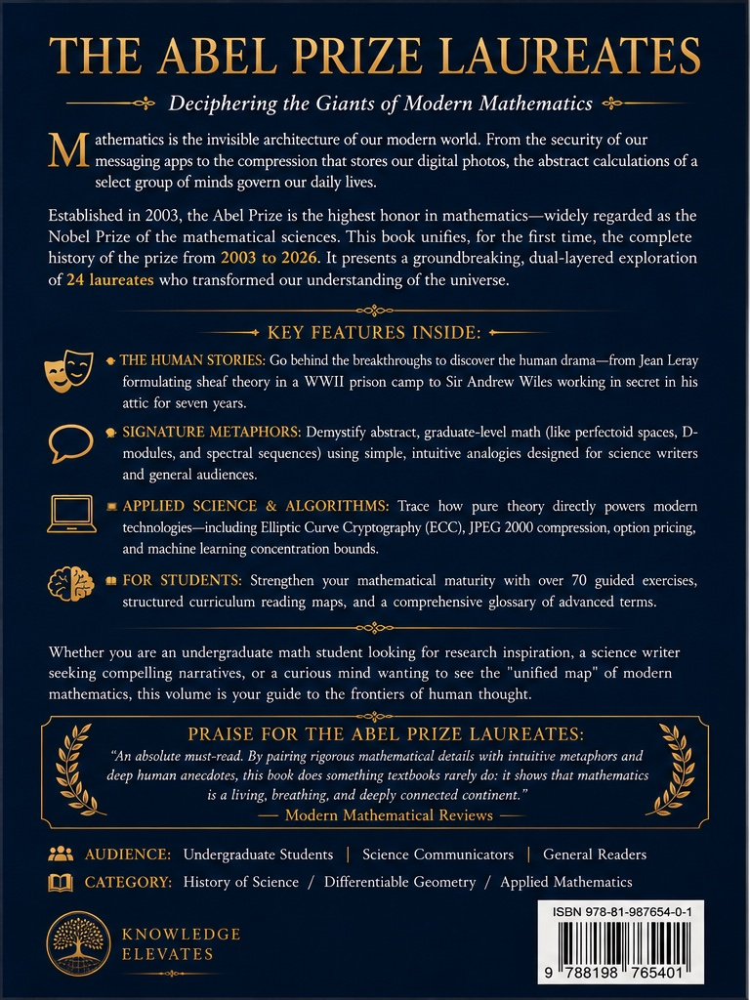

# The Abel Prize Laureates

### *A Comprehensive Report for Students and Science Writers*

---

## About the Book

**The Abel Prize Laureates** is a comprehensive guide to every Abel Prize awarded from its inauguration in 2003 through 2024 — covering 22 prize years and 27 individual laureates. Written by **Chaman Singh Verma**, the book shatters the perception that modern mathematics is a collection of isolated, impenetrable subfields, instead revealing the deep structural unity across topology, geometry, algebra, number theory, and analysis.

Each chapter is a self-contained portrait of a laureate and their breakthrough, structured in six pedagogical layers:

| Layer | Purpose |
|---|---|
| **Biographical Sketch** | Education, advisors, and career milestones |
| **High-Level View** | Jargon-free explanations with a signature metaphor |
| **Behind the Breakthrough** | Narrative history, anecdotes, and mentors |
| **Applied Science & Algorithms** | Real-world applications and computational implementations |
| **The Research Frontier** | Open problems and active research directions |
| **Guided Exercises** | Graded challenges for students |

---

## Who This Book Is For

- **Advanced undergraduates** seeking inspiration for research directions
- **Science writers** searching for human narratives behind mathematical breakthroughs
- **The mathematically curious** who want a guided tour of 21st-century mathematics

---

## Chapters

| Year | Laureate(s) | Field(s) |
|---|---|---|
| 2003 | Jean-Pierre Serre | Algebraic topology, algebraic geometry, number theory |
| 2004 | Michael Atiyah & Isadore Singer | Index theorem, K-theory, geometry, analysis |
| 2005 | Peter Lax | PDEs, fluid dynamics, scattering theory |
| 2006 | Lennart Carleson | Harmonic analysis, dynamical systems |
| 2007 | S.R. Srinivasa Varadhan | Probability theory, large deviations |
| 2008 | John G. Thompson & Jacques Tits | Finite group theory, buildings, BN-pairs |
| 2009 | Mikhail Gromov | Geometric group theory, Riemannian geometry |
| 2010 | John Tate | Number theory, class field theory, p-adic Hodge theory |
| 2011 | John Milnor | Topology, differential geometry |
| 2012 | Endre Szemeredi | Combinatorics, ergodic theory, additive combinatorics |
| 2013 | Pierre Deligne | Algebraic geometry, Weil conjectures, Hodge theory |
| 2014 | Yakov Sinai | Ergodic theory, dynamical systems, statistical mechanics |
| 2015 | John Nash & Louis Nirenberg | Game theory, PDEs, differential geometry |
| 2016 | Andrew Wiles | Number theory, elliptic curves, Fermat's Last Theorem |
| 2017 | Yves Meyer | Wavelets, signal processing, applied harmonic analysis |
| 2018 | Robert Langlands | Automorphic forms, the Langlands program |
| 2019 | Karen Uhlenbeck | Geometric PDEs, gauge theory, minimal surfaces |
| 2020 | Hillel Furstenberg & Grigory Margulis | Ergodic theory, probability on groups, Lie groups, expanders |
| 2021 | Laszlo Lovasz & Avi Wigderson | Graph theory, computational complexity, pseudorandomness |
| 2022 | Dennis Sullivan | Topology, dynamical systems, string topology |
| 2023 | Luis Caffarelli | PDEs, free boundary problems, regularity theory |
| 2024 | Michel Talagrand | Probability theory, concentration of measure, spin glasses |

---

## Features

- **Pedagogical callout boxes** — *Knowledge Bridge*, *Quick Primer*, *The Big Idea*, *Why This Matters*, and *Analogy Corner* appear throughout
- **TikZ connection graph** — a directed graph in the introductory chapter visualizes how fields interconnect
- **Undergraduate Jargon-Buster** — a comprehensive glossary of advanced mathematical terms
- **Automatic index generation** for easy reference

---

## Back Cover

**Categories:** History of Mathematics · Modern Mathematical Ideas · Applied Mathematics

---

*Compiled with LaTeX. All chapters written as `.tex` sources for reproducible PDF generation.*
